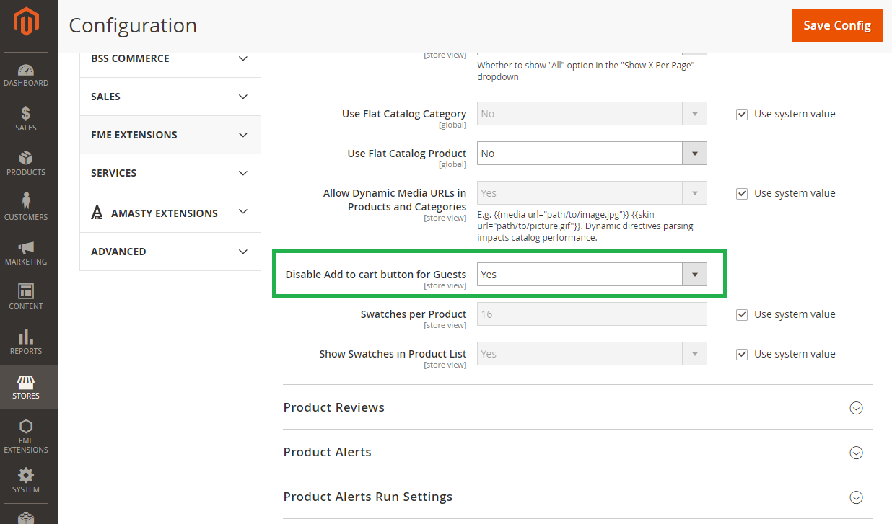

# Magento 2 - Disable add to cart button
 
## Overview
This module enable possibility to disable Add to cart button from product and category page for not logged in customers.
It can be useful for B2B customers, if we don't want to allow guest to add product to cart.

## Compatibility
- Magento 2.1, 2.2, 2.3, 2.4

## Installation details
1. Run `composer require landofcoder/magento2-remove-add-to-cart`
2. Run `php bin/magento module:enable Bodak_DisableAddToCart`
3. Run `php bin/magento setup:upgrade`
4. Run `php bin/magento cache:clean`

## Configuration details
1. Go to Magento admin interface 
2. Find option in `Stores > Configuration > Catalog > Catalog`
3. Under the `Storfront` tab you will find the `Disable Add to cart button for Guests` option  
5. `Enable` this option to activate the plugin

### Module configuration - administration panel

### Removed Add to cart button in catalog - frontend view

### Removed Add to cart button in product cart - frontend view

## Uninstall
1. Run `composer remove landofcoder/magento2-remove-add-to-cart`

## License
[MIT License](LICENSE)
